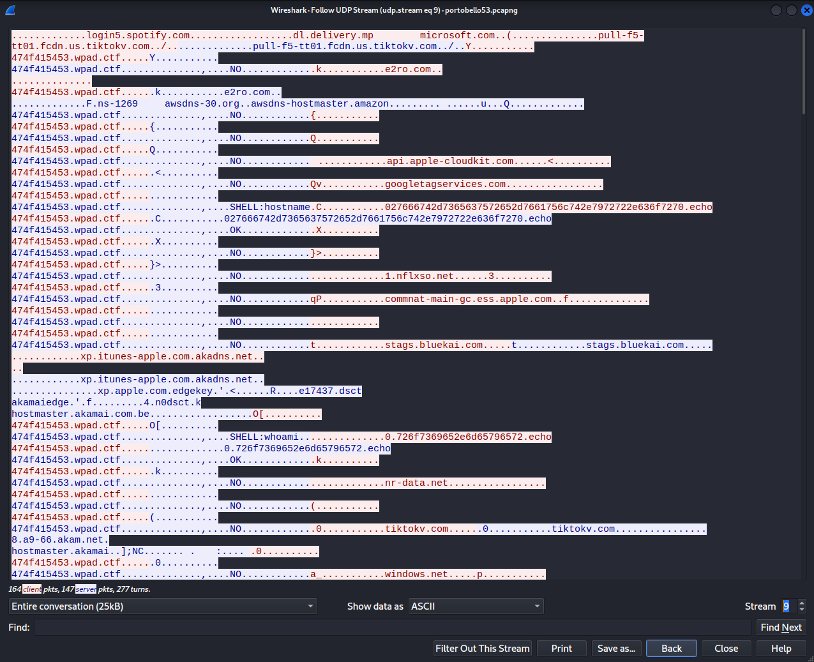
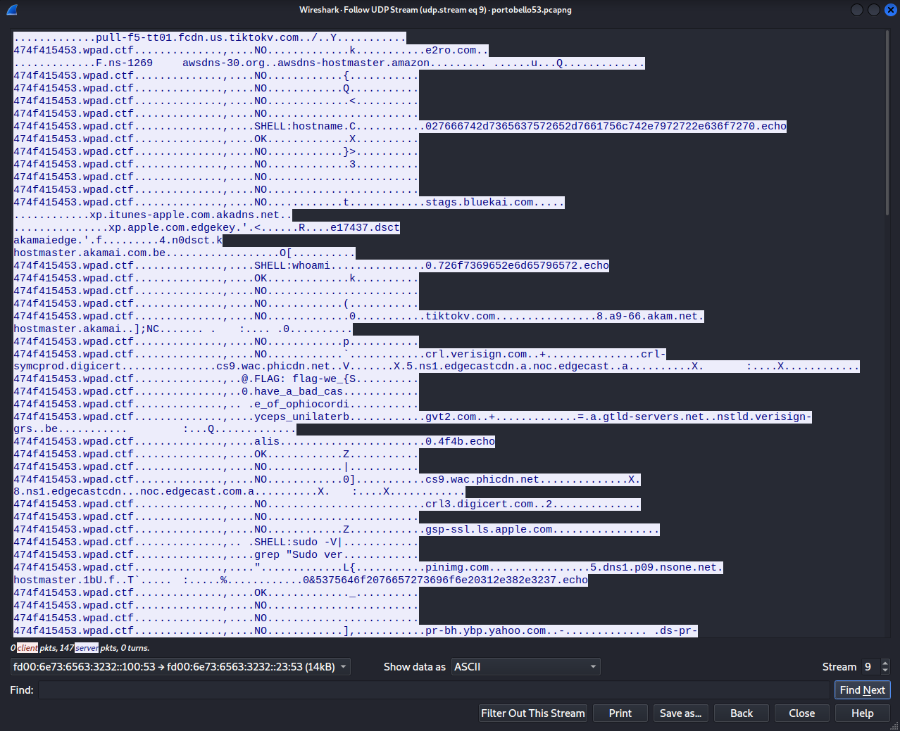
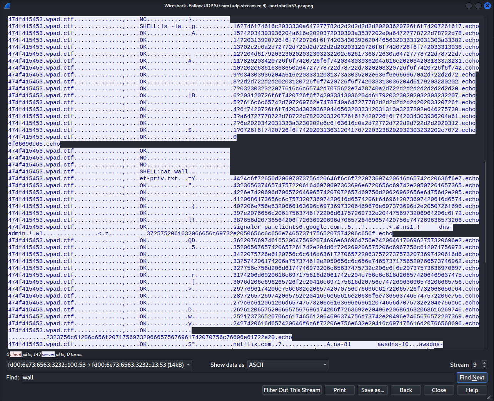
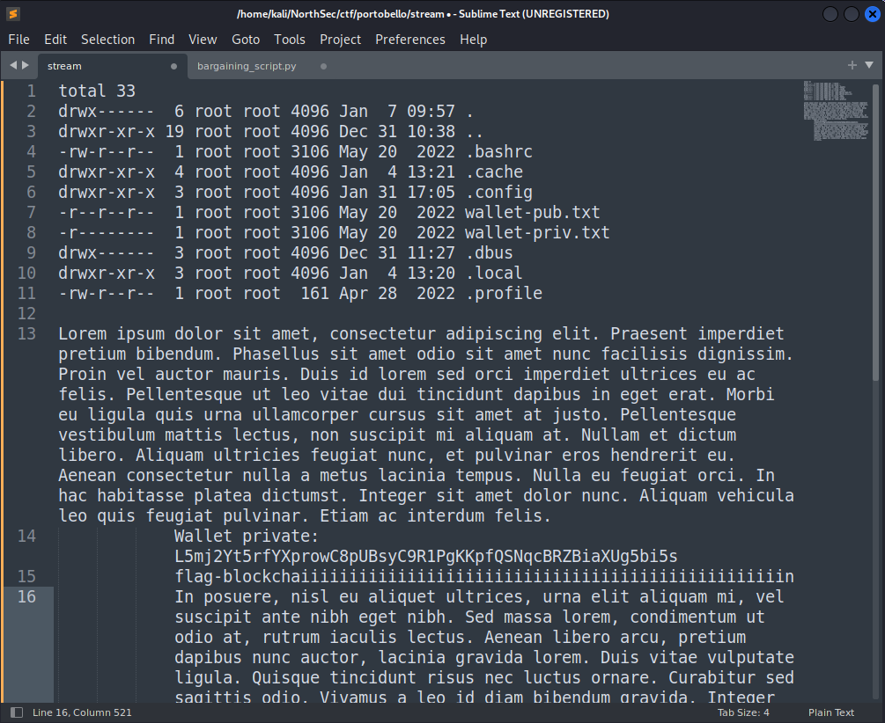

Back to examining the UDP streams in the original packet capture, portobello53.pcapng. UDP stream 9 with communication between /[IPV6/]::23 and /[IPV6/]::100 has some pretty suspect keywords present in the data...

{: .mx-auto.d-block :}

As you can see, "SHELL:hostname" and "SHELL:whoami" stand out like sore thumbs. Let's investigate.

## Bargaining 1/3

By looking at half of the stream with /[IPV6/]::100 as the sender, we can easily identify some more linux commands, but also our first flag!

{: .mx-auto.d-block :}
 
This is simple enough that we can just read and submit the 2 point flag right from here:  
**flag-we_have_a_bad_case_of_ophiocordyceps_unilateralis**

## Bargaining 2/3

I actually missed the second flag for quite some time - as it turns out, each *emotion* category of the portobello stream had a forum post on the NSec challenge board. For the Bargaining category, it  indicated that the second flag is the MD5 hash of the CVE that identifies the vulnerability exploited in this UDP stream in the format "flag-bargaining-*MD5Hash*".

It's easier to see after decoding the rest of data, but you can infer what is happening with the plaintext commands already present in the data.

```
SHELL:hostname
SHELL:whoami
SHELL:sudo -V| grep "Sudo ver"
SHELL:sudo -u#-1 /bin/bash
SHELL:id -un
SHELL:ls -la
SHELL:cat wallet-priv.txt
```

Upon connection, the actor collects some basic information before checking what version of sudo is running. Presumably, the identified version has a vulnerability whereby the next sent command, `sudo -u#-1 /bin/bash`, escalates the privilege of the user which the actor then confirms with the `id -un` command.

Searching for `sudo -u#-1 /bin/bash` on Google identifies "CVE-2019-14287", and passing that into an MD5 Hash calculator results in our next flag for 1 point:  
**flag-bargaining_739d80f289f091f1d5faf12cfd25fe83**.

## Bargaining 3/3

One obvious thing in the data is that this particular tunnel echos back the response from the shell commands likely as a form of acknowledgement of receipt, meaning, everything of interest is present in one side of the conversation. The `ls` and `cat` commands will likely return some interesting data, and sure enough there are large chunks of data being returned from the commands present in the data.

{: .mx-auto.d-block :}

The next thing of note is the encoding scheme in use. Here, take a look at an ASCII Table and see if it jumps out...

{: .mx-auto.d-block :}

Yeah! It looks like it is passing a string of hex values representing ASCII data. Let's copy and paste the data into sublime and use some RegEx-fu again to isolate the strings in question.

{: .mx-auto.d-block :}

From here, we should be able to just pass them to python to interpret and print properly. 

```python
bytestring = b'4c6f726...'
print(bytes.fromhex(bytestring.decode('utf-8')))
```

The results:

{: .mx-auto.d-block :}

Which provides us the last flag in this category for another 2 points:  
**flag-blockchaiiiiiiiiiiiiiiiiiiiiiiiiiiiiiiiiiiiiiiiiiiiiiiiiiin**.