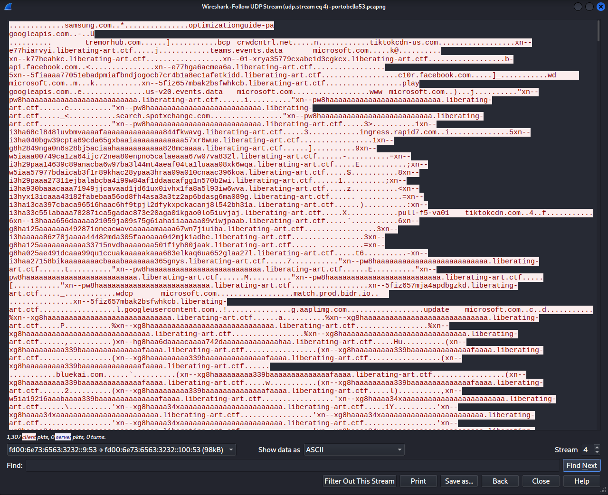
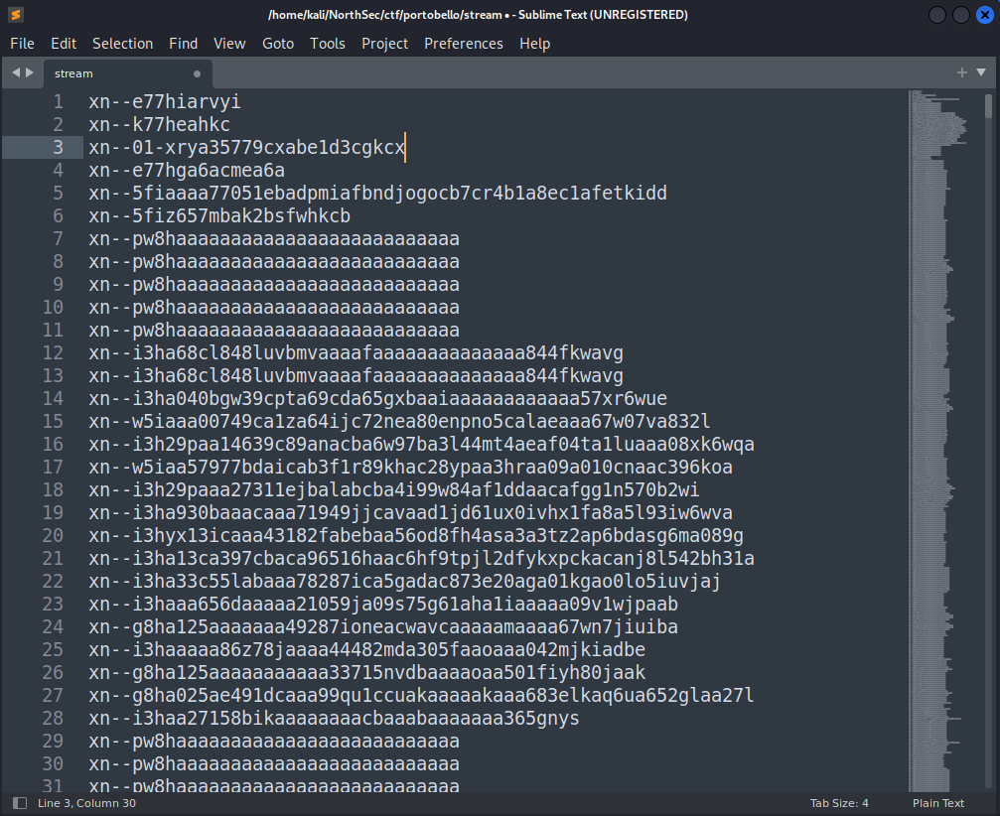
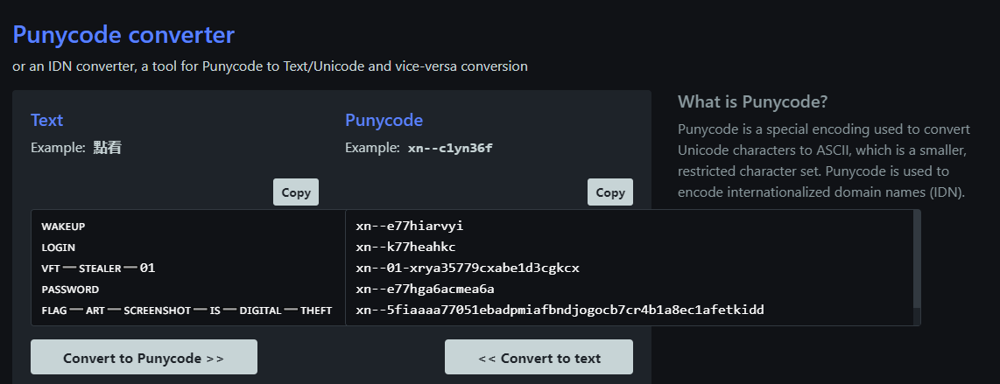
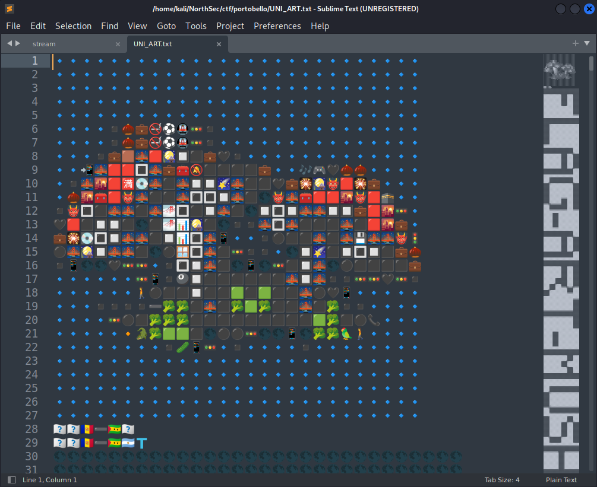
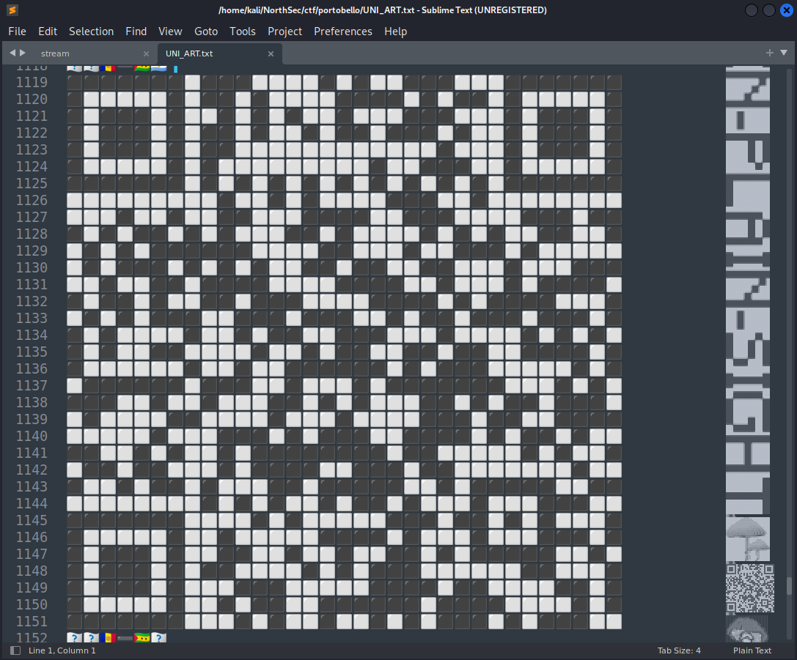
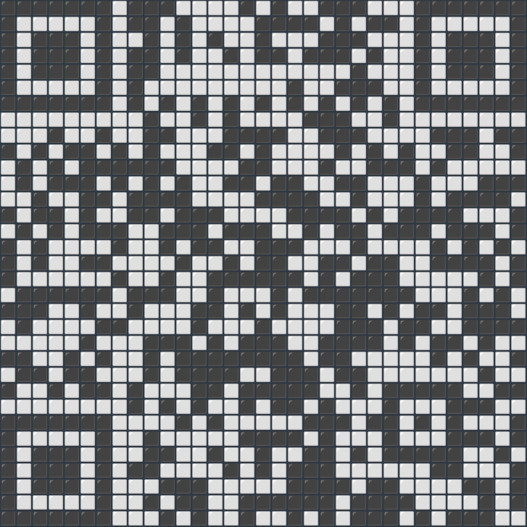

The final interesting UDP stream, stream 4, is all that's left of the Portobello challenge stream. This one actually gave me some problems - I didn't immediately recognize the encoding scheme. In any case, let's walk through the solution.

## Depression 1/3

Similar to other DNS tunnels, the data is repeated in the sender and receiver, so we need only look at one side of the conversation between \[IPV6\]::9 and \[IPV6\]::100.

{: .mx-auto.d-block :}

Like in previous challenges, I find it's usually simplest just to copy and paste the data into sublime, then use a bit of RegEx to isolate the data. In this case, it's extra simple since each piece of data starts with `xn--` and ends with `.liberating-art.ctf`.

{: .mx-auto.d-block :}

This resulted in a relatively big file, with 1223 lines. Though we still need to figure out how this is encoded... 

Notice on line 3, there is a unique line that starts with `01-`. I thought that could mean the data before the 01 was maybe the key to decipher the following data, and explored `xor` encoding schemes to no avail. 

Eventually (and after a day of thought, since my power went out and I wasn't able to do much else at the time), I googled `xn--` and came across the [Internationalized domain name](https://en.wikipedia.org/wiki/Internationalized_domain_name#Example_of_IDNA_encoding) wiki page.

It turns out, this is an encoding scheme used to represent domain names containing non-ASCII characters as ASCII, also referred to as *Punycode*. So all that's left is to figure out a way to decode it.

I found a [website](https://www.punycoder.com/) that will allow me to test a few lines of code to make sure I'm on the right track.

{: .mx-auto.d-block :}

Nice! It worked, and we have our first flag:  
**flag-art-screenshot-is-digital-theft**.

## Depression 2/3

I spent a good hour or two trying to get various punycode packages to work with python, but I always ran into issues on certain lines. In the end, I wasn't able to automate the entire process, so resorted to a combination of [punycoder.com](https://www.punycoder.com/) and [CyberChef](https://gchq.github.io/CyberChef/) to decode the entirety of the data. This took about 20 minutes - it wasn't too bad since they both accept multiple lines at a time. Eventually, I was left with a long file of... UNICODE art?

{: .mx-auto.d-block :}

There are a few "images" of mushrooms in here, keeping with the theme of the CTF, and as you can see along the overview of the file on the right of sublime in the previous image, there is a flag hidden in the UNICODE art. We have our next flag, worth 1 more point:  
**flag-art-mushroom-are-hidden-in-plain-sight**.

## Depression 3/3

The last flag was pretty obvious by this point - near the bottom of the file, represented with UNICODE characters, was a QR code!

{: .mx-auto.d-block :}

Cut the image down to just the QR code...

{: .mx-auto.d-block :}

...and you can upload it to an [online tool](https://4qrcode.com/scan-qr-code.php) that will spit out the final Portobello flag, for a whopping 3 points:  
**FLAG-ART-EXFIL-METHOD-IS-TRUE-MASTERPIECE**.
