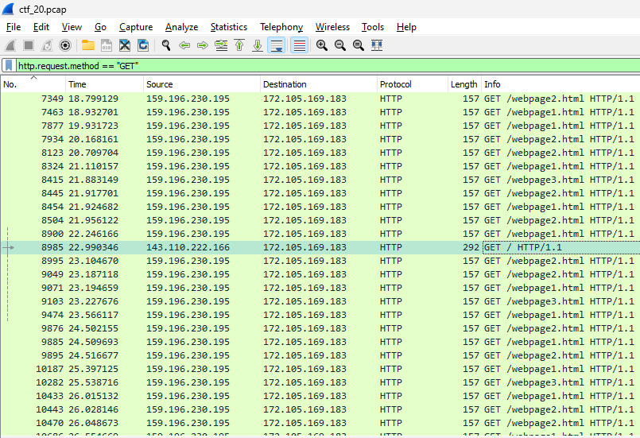
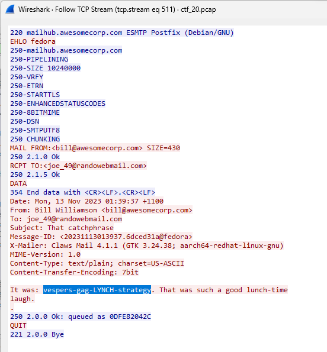

The task seemed straightforward yet mysterious: analyze a traffic dump from a mail server suspected of leaking confidential company info.
 
The challenge description was as follows:
>You suspect that someone has been emailing confidential company information. So you take a traffic dump from the mail server and then analyse it on your own laptop.
The clue to the challenge was subtly hidden in its title, with "Helo" being a play on the SMTP protocol's commands (HELO/EHLO).

## Initial Analysis with Wireshark

Armed with a pcap file, I launched into the investigation using Wireshark. The presence of HTTP was immediately noticeable. Filtering HTTP traffic **(http.request.method == "GET")** revealed repetitive GET requests to three web pages, with one odd request standing out - a GET request to the root directory. However, this turned out to be a red herring, leading to a Wikipedia page.

{: .mx-auto.d-block :}

## The Real Breakthrough: SMTP

Taking a cue from the challenge's name, I checked the Protocol Hierarchy under Wireshark's Statistics and, sure enough, SMTP surfaced. Filtering for SMTP led to a crucial discovery: SMTP/IMF packets that made email content readable. Among the five emails found, "Project List" was notably large and contained x-7z-compressed data.

{: .mx-auto.d-block :}

## Cracking the Code

The plot thickened when I found an email from an employee, Bill, sending a file **to_send.7z** to **joe_49@randowebmail.com**. This file, encoded in base64, was extracted using CyberChef, revealing a password-protected 7zip archive.

{: .mx-auto.d-block :}

## Finding the Password

Intriguingly, another email titled "That catchphrase" contained what seemed like a random string **vespers-gag-LYNCH-strategy**. This, however, turned out to be the key to unlocking the archive!

{: .mx-auto.d-block :}

## The Flag Revealed

Upon unlocking the archive with the catchphrase as the password, a PDF titled "Flag.pdf" was found. And there it was, for a whopping 340 points, the flag we'd been seeking: **The_Net_Never_Lines_Up**.

## Key Takeaways

1. Attention to Detail: Small hints, like the misspelled "Helo", can be significant.
2. Tool Proficiency: Mastery in tools like Wireshark and CyberChef is crucial.
3. Patience and Curiosity: Sometimes, the obvious path is a diversion; the real clues lie deeper.
